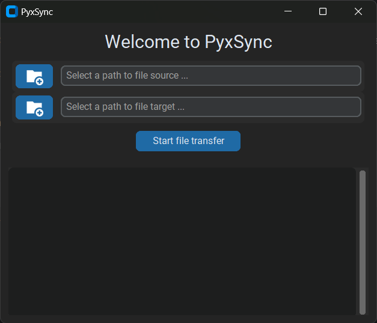

      _____             _____                  
     |  __ \           / ____|                 
     | |__) |   ___  _| (___  _   _ _ __   ___ 
     |  ___/ | | \ \/ /\___ \| | | | '_ \ / __|
     | |   | |_| |>  < ____) | |_| | | | | (__ 
     |_|    \__, /_/\_\_____/ \__, |_| |_|\___|
             __/ |             __/ |           
            |___/             |___/      
# PyxSync

PyxSync is a straightforward Python app with a simple UI designed to assist photographers in organizing their image and video files when importing them from the camera to a computer. 

Users simply select the source and target directories, and the files are automatically transferred. 

The script utilizes Exif data to detect the camera model and date range, ensuring images are placed in a structured directory format: 

*target_dir/camera_model/date_range/*

### How to Run:

To run PyxSync on Windows PCs, you can download and execute the `.exe` file from the releases.

Alternatively, you can run the app by following these steps:

1. Clone the repository.
2. Create a virtual environment.
3. Pip install the required dependencies from `requirements.txt`.
4. Run `python main.py`

### Adding a file format:

By default, the app - and as a result its releases - support .NEF, .ARW, .JPG and .MP4 files.
To enable processing of other file formats, they have to be added to the relevant `ExtensionsEnum` in `file_extensions.py`.